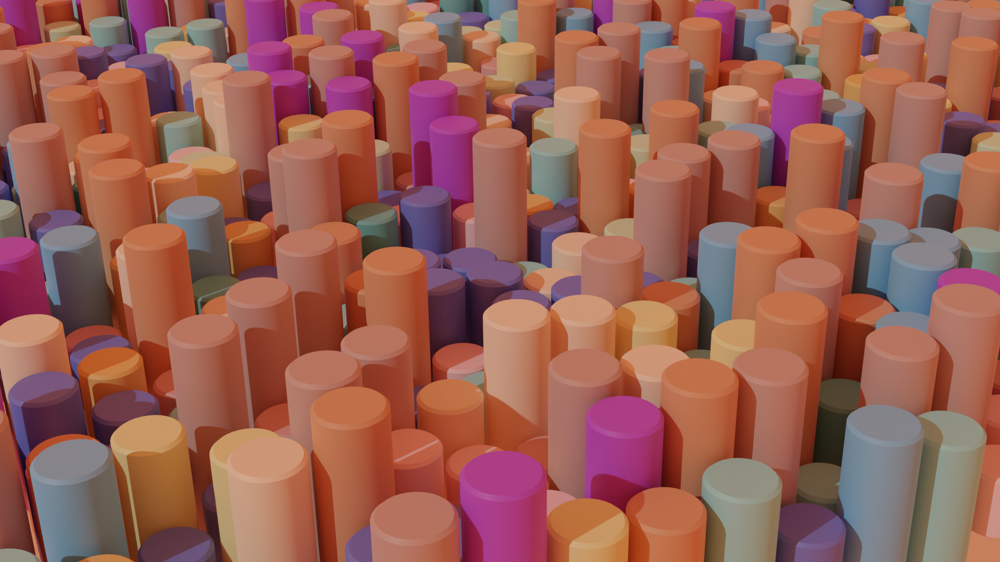

# Blender Art Generator

## Getting started

<ul>
    <li>Clone repository</li>
    <li>Open united1.blend via Blender</li>
    <li>Scripting >> Alt+P or click Run Script button</li>
</ul>

## Example

